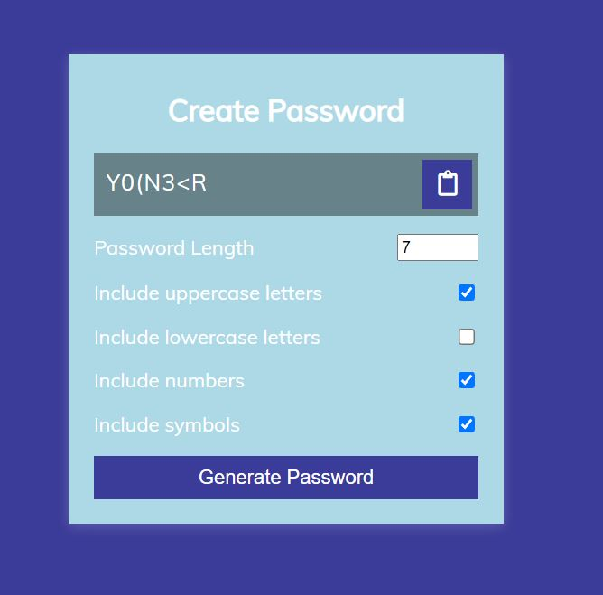

# ⭐ Project - Password Generator ⭐

This  project of javascript is made from pure HTML,CSS and Javascript.

 

📌 Learnings:

👉 1\. HTML, CSS and DOM Manipulation 
👉 2\. How to copy from clipboard. 
👉 3\. How to call different functions randomly using objects. 
👉 4\. Object.keys() and Object.values() 
👉 5\. HOF (Higher order functions like filter, ) 
👉 6\. Manipulation booleans.  

 

> Time taken to build this project is 4 hr.

  

## Links

[Link](javascriptmypasswordgenerator.netlify.app)

[Linkedin](https://www.linkedin.com/in/pratyush-kesarwani-2b6601171/)

### Acknowledgements:

I am thankful to Hitesh Choudhary sir, Anurag sir and iNeuron team for this amazing bootcamp.
